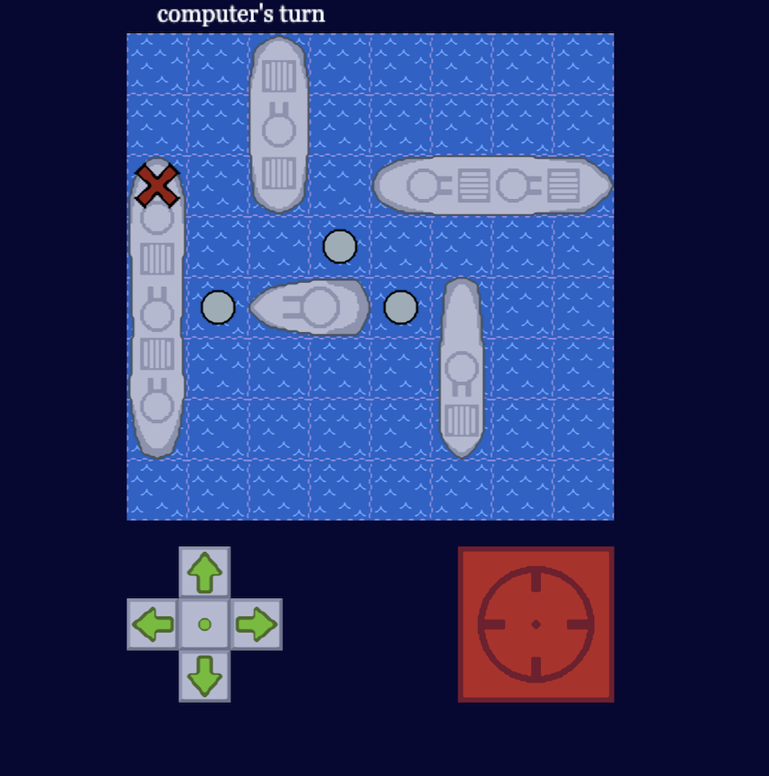
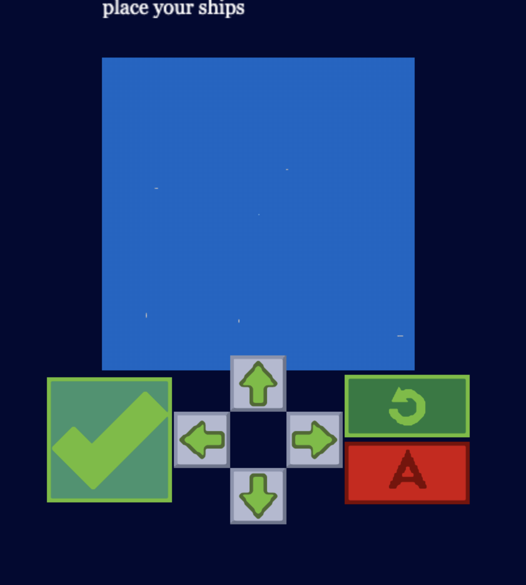

  

 

Battleships is a game that was started in 1931, and was known as the "Paper and Pencil" game following World War I. The first board game was released by Milton Bradley (now called [Hasbro](https://corporate.hasbro.com/en-us)). The first electronic battleship was created in 1967.

## Features
	- Mobile browser game
	- Responsiveness
	- Scalable to different browser sizes
	- Large browser support
	- Replay without browser refresh
	- Single player (vs. bot)
	- Changeable board size

	This game is meant for <strong style="color: #EC5113">mobile</strong> browsers, but can be played on desktop. There is only <strong style="color: #EC5113">single player</strong> (vs. bot) mode. The game starts with allowing the player to select a board size. the board sizes can range from <strong style="color: #EC5113">6x6</strong> tiles to <strong style="color: #EC5113">12x12</strong>. Once started, the player will transition to the game scene. In this scene, ships are randomly placed for both the player and computer. The player can pick up ships, rotate, and place them before starting the game. There are 5 ships in the game, ranging from 2-5 grid spaces long.

	The goal of the game is to sink every enemy ship. Each player is allowed a turn with unlimited time to fire. When the player finishes their turn, the screen fades to display the other player board. When the game ends, the player can press "Play Again". The game can be replayed without needing to be refreshed.

Link to the active game:
[

](https://battleships-tpofahl.vercel.app/)

## Preview

	

		

## Note

	This game was created with .svg, anything .png is for this readme. The board size can only move in increments of 2. I plan on making this game multiplayer on both mobile and browser. The board side can be editied to go beyond a 12x12 grid. 

	Below is a picture of the game at <strong style="color: #EC5113">250x250</strong> tiles. Weeks of fun.

		

## Issues
* Certain screen sizes on desktop cause the player's directional pad to intersect with other parts of the gamepad.
* Board size can only be set in even increments.
* Changing browser size on will not adjust the game. Needs to be refreshed from the browser.
* Cannot change quantity of ships placed.
